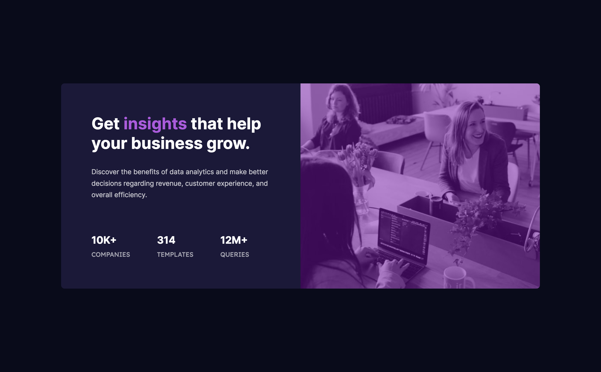

# Frontend Mentor - Stats preview card component solution

This is a solution to the [Stats preview card component challenge on Frontend Mentor](https://www.frontendmentor.io/challenges/stats-preview-card-component-8JqbgoU62). Frontend Mentor challenges help you improve your coding skills by building realistic projects.

## Table of contents

- [Overview](#overview)
  - [The challenge](#the-challenge)
  - [Screenshot](#screenshot)
  - [Links](#links)
- [My process](#my-process)
  - [Built with](#built-with)
  - [What I learned](#what-i-learned)
  - [Continued development](#continued-development)
  - [Useful resources](#useful-resources)
- [Author](#author)

## Overview

hmmm "a friend said its little things that break your code"
The code took longer than i expected, turned out that i knew the solution all along but i was trying to work with a pre-supposed solution and i learnt alot while at it. We done now! you can read through

### The challenge

Users should be able to:

- View the optimal layout depending on their device's screen size

### Screenshot

### Links

- Solution URL: [Add solution URL here](https://your-solution-url.com)
- Live Site URL: [Add live site URL here](https://your-live-site-url.com)

## My process

- Read instructions
- Analyize design, observe document flow and element structure.
- Wrote the html code first
- Then applied styles in css
- Had to go through a debugging phase
- Edit read-me page
- create repository on github
- upload file to Github and gitpage

### Built with

- Semantic HTML5 markup
- CSS custom properties
- Flexbox
- CSS Grid
- Mobile-first workflow

### What I learned

- First time using the Mobile-first workflow
- learnt about the picture element and its source child element

### Continued development

i intend on building more components, then webpages, websites using html, css and javascript and frontend tools.

### Useful resources

- What actually helped me was a course i took by Jonas on Udemy

## Author

- Website - [Maduka Chisom](https://www.your-site.com)
- Frontend Mentor - [@chisomwest](- Frontend Mentor - [@chisomwest](https://www.frontendmentor.io/profile/yourusername))
- Twitter - [@chisomGmaduka](https://twitter.com/ChisomGMaduka)
